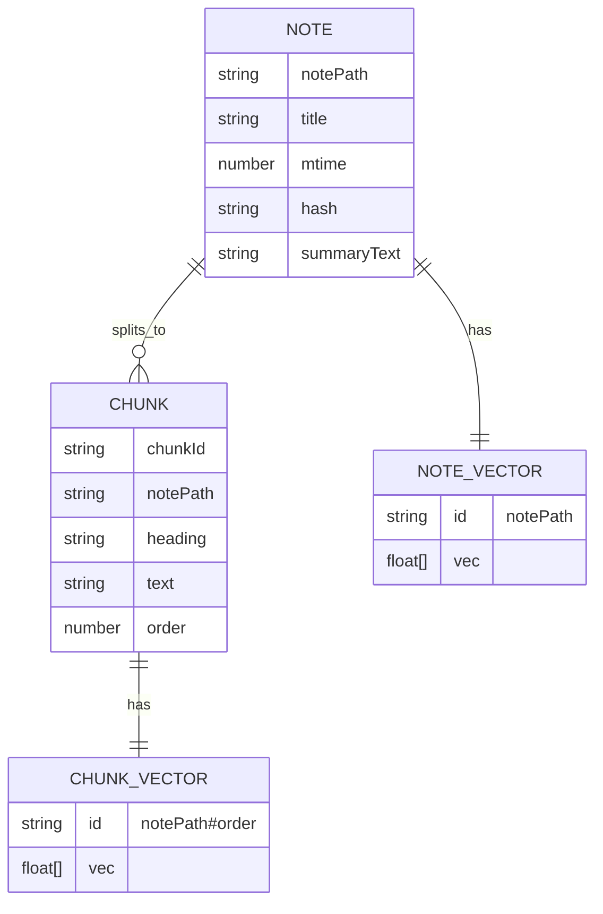
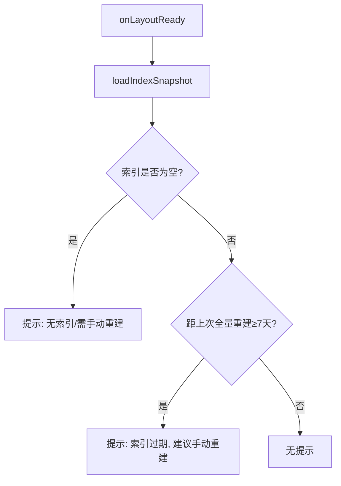
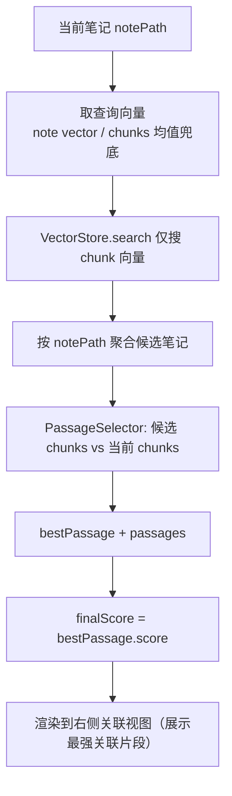

# 工作流与概念说明（中文）

> 面向当前仓库中的实现：`src/main.ts`、`src/indexing/*`、`src/search/*`、`src/views/*`。

## 1) 右侧「关联视图」怎么用？需要自己打开吗？

关联视图是一个独立的右侧侧栏视图（Connections View），用于展示“当前正在看的笔记”和“其他笔记”的语义关联结果。

打开方式有两种：

- **自动打开**：设置项 `启动时自动打开右侧关联视图`（`autoOpenConnectionsView`）为开时，插件在 `onLayoutReady()` 里创建右侧视图，但不会抢编辑器焦点。
- **手动打开**：通过命令面板执行 `打开关联视图`（command: `open-connections-view`）。

补充说明：

- 关联视图始终被放在 Obsidian **右侧侧栏**（插件会尽量避免把它打开到主编辑区）。
- 插件会保持 **只有一个** 关联视图叶子（leaf），避免重复打开导致的“多个关联视图同时存在”。
- 当关联视图本身成为 active leaf 时，`workspace.getActiveFile()` 可能返回 `null`，因此视图会回退到“主编辑区最近活动的 leaf”来确定当前笔记。

视图刷新时机（不涉及远程 embedding 调用）：

- 当前活动叶子（正在编辑/阅读的笔记）变化时刷新
- 当前笔记文件被修改时刷新（仅刷新 UI 结果；是否“变得更准”取决于索引是否最新）

> 注意：开启 `自动增量索引`（`autoIndex`）后，文件新增/修改会在短暂防抖后自动进入增量索引流程，删除/重命名也会自动更新索引；关联视图的查询/渲染本身仍不调用 embedding。`同步变动笔记` 依然有用：它适合你想主动对整个 Vault 再做一次补扫时使用。

## 2) 「索引」到底是什么？（索引图概念）

插件的“索引”由三份核心数据 + 一份快照组成：

- **NoteStore**：每篇笔记的元数据（title/mtime/hash/summaryText…）
- **ChunkStore**：每篇笔记切分后的语义块（chunk）元数据（heading/text/order…）
- **VectorStore**：向量存储（既存 note-level 向量，也存 chunk-level 向量）
- **Snapshot**：磁盘快照（`index-store.json` + `index-vectors.bin`）

快照加载时会做兼容性校验：若 embedding provider / baseUrl / model / 维度 / 切分策略 / note 向量策略不一致，则跳过加载并提示用户手动重建索引。

`VectorStore` 的 id 规则：

- **笔记向量（note-level）**：`id = notePath`（不含 `#`）
- **段落向量（chunk-level）**：`id = chunkId = ${notePath}#${order}`（包含 `#`）



## 3) 索引如何更新？（全量重建 vs 变动同步）

### 3.1 全量重建（手动）

- 触发方式：命令 `重建索引` 或设置页按钮 `重建`
- 行为：清空旧索引/错误日志 → 扫描所有笔记 → 切分 chunks → 批量生成 chunk embedding → 聚合 note 向量 → 写入 3 个 Store → 保存快照
- 成功后：更新 `lastFullRebuildAt`（用于启动时“7 天提醒”）
- 容错：全量索引按文件顺序执行；单文件失败会记录到错误日志并继续下一个文件（不会因为一个文件失败导致全量重建整体中断）

```mermaid
flowchart TD
  A[用户触发「重建索引」] --> B[清空旧索引（3 Stores）+ 清空错误日志]
  B --> C[Scanner 获取所有 Markdown 文件]
  C --> D{对每个文件}
  D --> E[读内容 + buildNoteMeta]
  E --> F[Chunker 切分为 chunks]
  F --> G[ReindexService 生成 embedding payloads]
  G --> H[EmbeddingService.embedBatch -> chunk vectors]
  H --> I[聚合 note vector = mean(chunk vectors)]
  I --> J[写入 NoteStore/ChunkStore/VectorStore]
  J --> D
  D --> K[保存 Snapshot: index-store.json + index-vectors.bin]
  K --> L[settings.lastFullRebuildAt = now]
```

### 3.2 启动时 7 天提醒（不自动重建）

插件启动不会自动全量重建；只会在满足条件时提醒：

- 若 `lastFullRebuildAt` 距今 ≥ 7 天 → 弹出 Notice 提醒用户手动重建



### 3.3 自动增量索引（默认关闭）

这个开关（`autoIndex`）的目标是：在你频繁编辑时，只对受影响的笔记自动更新索引，而不是每次都手动全量重建。

开启后插件会：

- **create/modify**：在编辑停止一小段时间后读取内容并计算 hash；若检测到与已索引版本不一致，则自动把该笔记加入增量索引队列，并重新生成向量。
- **delete**：把 delete 任务加入 `ReindexQueue`（防抖/去重），并级联清理 Note/Chunks/Vectors。
- **rename**：把 rename 任务加入 `ReindexQueue`，迁移各 Store 的 key/id；必要时刷新 NoteMeta。若内容也发生变化，会在后续流程中继续按需更新。

要真正更新向量并让结果“变得更准”，需要你手动触发一次远程嵌入：

- 命令 `Sync Changed Notes（同步变动笔记）`：扫描并列出新增/修改/待同步的笔记，确认后逐篇生成 embedding 并写回索引。
- 或在关联视图的提示条点击 `[立即同步]`（只同步当前笔记）。

```mermaid
flowchart TD
  A[文件事件: create/modify/delete/rename] --> B{autoIndex 开启?}
  B -- 否 --> X[忽略]
  B -- 是 --> C{事件类型}
  C -- create/modify --> D[scheduleDirtyCheck -> 计算 hash -> 标记 dirty/outdated]
  C -- delete/rename --> E[ReindexQueue.enqueue 防抖/去重]
  E --> F[flush -> ReindexService.processTask(delete/rename)]
  D --> G[scheduleIndexSave 10s 合并写盘]
  F --> G

  H[命令: 同步变动笔记] --> I[扫描 Vault 变动/新增笔记]
  I --> J[用户确认]
  J --> K[逐篇 indexFile -> 远程 embeddings]
  K --> G
```

## 4) 「关联视图」到底在匹配什么？（笔记 vs 段落）

当前实现采用“**chunk 召回 → 候选笔记 → chunk 重打分（找最强片段）**”的方式，核心目标是避免“大笔记的 note-level 向量被均值化后语义稀释”，同时让 UI 展示的片段与排序口径一致。

1. **chunk 召回（chunk-level recall）**：用“当前笔记的查询向量”（优先使用持久化的 note-level 向量；缺失时用当前 chunks 的均值兜底），在全量 **chunk-level 向量** 中检索 topK，得到候选笔记集合。
2. **按笔记聚合**：将命中的 chunks 按 `notePath` 归类（同一篇笔记可以命中多个 chunks），用于候选笔记粗筛。
3. **chunk 重打分（PassageSelector）**：对每篇候选笔记，计算“候选笔记每个 chunk”与“当前笔记所有 chunks”的最大相似度，选出得分最高的那一段作为 **最强关联片段**（`bestPassage`），并按需截断为 `passages`。
4. **透明化聚合分值（Log-Sum-Exp）**：对 `passages` 的分数做 log-sum-exp 聚合得到 `passageScore`，用于 tooltip 透明化展示（不再用于主排序）。

分数说明（越大越相关）：

- `noteScore`：最强关联片段的原始分值（等同 `bestPassage.score`，也是 UI 主显示的「相关度」）
- `passageScore`：多段聚合分值（log-sum-exp），用于解释“多段同时命中”的强度
- `finalScore = noteScore`

UI 展示：

- 主界面：`相关度 76.1%`（严格等于 `原始分值 × 100`）
- Tooltip：`原始分值: 0.761`
- 卡片正文：直接展示「最强关联片段」的文本预览，帮助快速定位两篇笔记“对上号”的位置

这意味着你在 UI 上看到的是：

- **一个当前笔记 → 多个候选笔记**
- **每个候选笔记 → 0..N 个最相关段落（来自候选笔记）**



## 5) 「语义搜索」当前怎么处理？

语义搜索（Lookup）相关代码路径目前仍保留在仓库中，但当前阶段**不作为正式支持能力**，先列为待办事项，不纳入本阶段的使用流程与交付范围。

当前结论：

- 对外文档与日常使用建议，优先围绕“关联视图 / 索引构建 / 变更同步”展开。
- `打开语义搜索`（`open-lookup-view`）与 `LookupService.search(...)` 相关链路暂不作为当前承诺功能。
- 后续若重新推进语义搜索，会再统一整理交互、结果呈现、测试与文档。

待办范围（预留）：

- 提供稳定的自然语言查询入口与查询态 UI。
- 对 query 做一次 embedding，并在 chunk-level 向量中检索候选结果。
- 按笔记聚合结果，并展示最佳段落预览。
- 补齐对应的测试、边界行为说明与用户文档。

## 6) 切分方式 API 支持吗？

当前远程 provider 使用 OpenAI-compatible `/v1/embeddings`：

- 请求体 `input` 是字符串数组（批量）
- 插件会把每个 chunk 的 embedding payload（`heading + text`）控制在 1200 字符内，并在索引阶段再次验证/必要时二次切分（heading 上下文会先截断到 200 字符，避免超长标题主导 embedding）
- 默认 chunk 文本长度约 300–800 字符，并带 20% 重叠（stride ≈ 640）；切分策略变更后需要重建索引生效

因此“切分方式是否能被 API 接收”的关键点是：每条 `input` 不要过长、不要为空、批量大小合理；这些在当前实现里都有保护。


